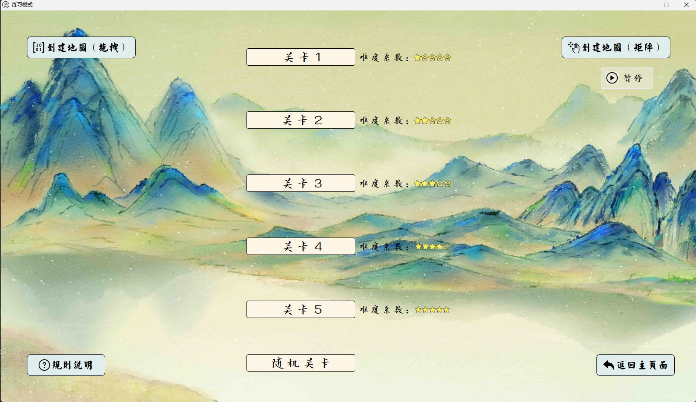

# Spring

### SCUT CPP大一实训作业-- :deciduous_tree: 植此青绿 

:innocent:自己做的背景，是不是挺好看的捏

#### 实训要求实现内容

###### Level 1：

1. 以合适的交互方式呈现赛题 :heavy_check_mark:
2. 模拟比赛要求，支持用户以玩家的方式做题，提交答案并判断答案正误 :heavy_check_mark:
3. 内含5道以上的试题，支持用户选题作答 :heavy_check_mark:
4. 记录玩家答题的信息，比如用时、正确率、得分等，形成用户排行榜 :heavy_check_mark:

###### Level 2：

1. 可自动生成题目并判断玩家答案正误 :heavy_check_mark:
2. 支持用户自己创建题目并作答 :heavy_check_mark:
3. 可将新题保存到题库 :heavy_check_mark:
4. 形成多元的用户排行榜，比如单题最快，累计分数最高等 :heavy_check_mark:

###### Level 3：

1. 可判断题目是否有解 :heavy_check_mark:

2. 玩家答题过程中可以提示 :heavy_check_mark:

   上面两个似乎纯acm内容，枚举+dfs+回溯

3. 用户出题可解答 :heavy_check_mark:

4. 可根据难度、盘面大小等参数灵活出题 :heavy_check_mark:

5. 游戏以闯关等更丰富的形式进行 :heavy_check_mark:

###### Level 4：

1. 更友好的操作界面和交互模式 :heavy_check_mark:

2. 以赛题为背景，更多创意的比赛方式

3. 支持双人对战或多人联网竞赛等 :heavy_check_mark:

   做了tcp模拟拆包+粘包，设计了报文结构并且模拟了tcp的连接过程（三次握手）

   实时传输数据，双方可以看到对方的进度和时间

4. 其他个性化发挥 :heavy_check_mark:

   #### 一些展示

   

   

   

   

   

   

#### 选题是实训要求给定的，不是我想做这个类型的游戏 :sob::sob::sob:

游戏本体在GWidget文件夹下面
具体的游戏内存太大github无法上传，想看一下的小伙伴可以点下面链接下载
###### （1）
链接：https://pan.baidu.com/s/1O7jChUNhmgSeCYWwRuAsFA?pwd=gnwl 
提取码：gnwl 
下载后进行解压得到的文件夹中直接双击GWidget.exe就可以开始游玩
###### （2）
链接：https://pan.baidu.com/s/1GoTLawUfXYyNUtrvMjmezw?pwd=6cu1 
提取码：6cu1 
是我打包好的安装程序，只需要下载后双击就可以自动安装啦

#### UPD 24/6/18 从rank中修复了一个bug，但是发行版没有再做修改重新上传，会出现排行榜文件不能正常加载的情况

#### :globe_with_meridians:联网对战的使用 

1. 点击比赛模式进入，登录/注册

2. 两方电脑连接在同一个局域网下

3. 一方打开联网服务器，一方打开联网客户端，客户端连接服务器主机的ip地址，服务器无需更改

4. 服务器进行监听，客户端进行连接

5. 点击后台运行，**记得不要关闭**

6. 双方同时进入游戏，然后就可以同时点击开始游戏并开始快乐联机了

   

#### :bug:说明一些游戏尚未修复的小bug

1. 排行榜页面的拖拽按钮只有一小块区域可以移动，这是由于窗口遮盖引起的（暂时未解决
2. 有时候由于网络连接原因会导致联机模式有一方右上角不显示对方的进度，只需要让对方点击一次重置就可以解决
